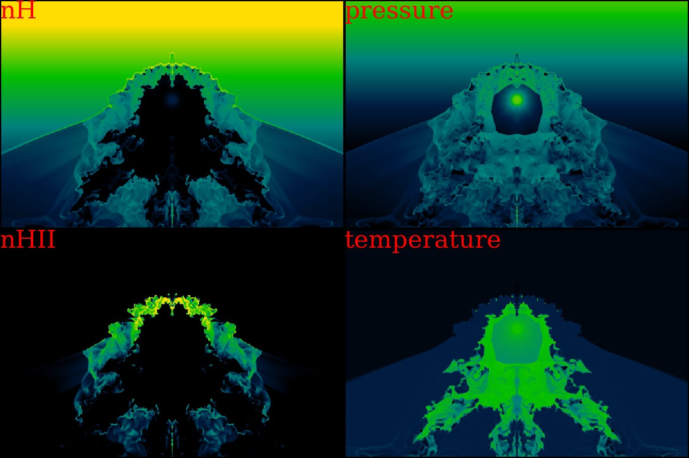

# Torch
### A fluid dynamics & radiation transport simulation code

******************************

####Overview
A 3D Eulerian fixed grid fluid dynamics code. The grid is a collection of finite 
elements, called grid cells, that each hold fluid state information. The hydrodynamics 
are solved using a rotated hybrid HLLC-HLL Riemann solver 
([Nishikawa & Kitamura 2008](#N8)) to calculate fluxes on each grid cell face. Ionisation 
from point source radiation is implicitly solved and the column densities required for 
this are calculated via an interpolative ray tracing scheme ([Mellema et al. 2006](#M6)). 
Heating/cooling from atomic processes is calculated using the approximate functions in 
[Henney et al. (2009)](#H9).

####Example Usage
First of all, the directory tree should look like this:
```
.
├── torch
├── refdata
|   ├── parameters.lua
|   └── setup.lua
```

To run, execute torch in an mpi environment (or not). For example, using 8 logical cores:
```bash
mpirun -np 8 ./torch
```
Problems are set up by modifying the lua configuration files "refdata/parameters.lua" and 
"refdata/setup.lua". In the parameters file, cgs units are assumed.  

#####Setup

For example, to set up a 2D cylindrically symmetric 368x490 mesh (each cell having width 1.854e18/368 cm) with a star located at (0, 276) parameters could be:

```lua
-- refdata/parameters.lua
Parameters = {
	Integration = {
		ambient_no_density =         8.0e3,
		density_scale =              1.0e-20,
		pressure_scale =             1.0e-28,
		time_scale =                 1.0e11,
		spatial_order =              1,
		temporal_order =             2,
		simulation_time =            3.15569e11,
		radiation_on =               true,
		cooling_on =                 true,
		debug =                      false,
		output_directory =           "tmp/",
		initial_conditions =         "",
	},
	Grid = {
		no_dimensions =              2,
		no_cells_x =                 368,
		no_cells_y =                 490,
		no_cells_z =                 1,
		geometry =                   "cylindrical",
		side_length =                1.854e18,
		left_boundary_condition_x =  "reflecting",
		left_boundary_condition_y =  "outflow",
		left_boundary_condition_z =  "reflecting",
		right_boundary_condition_x = "outflow",
		right_boundary_condition_y = "free",
		right_boundary_condition_z = "free",
	},
	Hydrodynamics = {
		gamma =                      1.67,
		density_floor =              1.0e-25,
		pressure_floor =             1.0e-17,
		temperature_floor =          10,
		riemann_solver =             "RotatedHLLC",
		slope_limiter =              "albada",
	},
	Radiation = {
		K1 =                         0.2,
		K2 =                         0.0,
		K3 =                         0.0,
		K4 =                         0.0,
		photoion_cross_section =     6.3e-18,
		case_b_recombination_coeff = 2.59e-13,
		tau_0 =                      0.6,
		minimum_hii_fraction =       0,
		temperature_hi =             300,
		temperature_hii =            10000,
		mass_fraction_hydrogen =     1.0,
		integration_scheme =         "implicit",
		collisions_on =              false,
		coupling =                   "neq",
	},
	Thermodynamics = {
		heating_amplification =      0.001,
	},
	Star = {
		on =                         true,
		cell_position_x =            0,
		cell_position_y =            276,
		cell_position_z =            0,
		snap_to_face_left_x =        true,
		snap_to_face_left_y =        false,
		snap_to_face_left_z =        false,
		snap_to_face_right_x =       false,
		snap_to_face_right_y =       false,
		snap_to_face_right_z =       false,
		photon_energy =              2.976e-11,
		photon_rate =                2.2e48,
		wind_radius_in_cells =       10,
		mass_loss_rate =             6.34e19,
		wind_velocity =              2.0e8,
		wind_temperature =           10000,
	},
}
```
The simulated span of time in this example is 10,000 years. Snapshots of the star 
would be taken at equally spaced intervals during this time and stored in tmp/.
 
An example of how to set up a problem is given in "refdata/setup.lua". For a star 
in an exponential density gradient (increasing up the z-polar axis):

```lua
-- refdata/setup.lua

hydrogenMass = 1.674e-24
specificGasConstant = 8.314462e7
PC2CM = 3.09e18
H = 0.05*PC2CM
T = 300
nHI = 8000

function initialise(x, y, z, xs, ys, zs)
	local z = (y - ys)/H
	local den = nHI*hydrogenMass*math.exp(z)
	local pre = specificGasConstant*den*T
	local hii = 0
	local v0 = 0
	local v1 = 0
	local v2 = 0
	return den, pre, hii, v0, v1, v2
end
```

The function ```initialise``` takes in six arguments: x (or r-polar), 
y (or z-polar) and z coordinates of the cell and the coordinates of the star (all in 
cm). Density, pressure, ionised hydrogen fraction, and velocity components are 
returned (in cgs units). This script is executed by Torch in order to set up the fluid
variables in a grid.

#####Output
Torch outputs compressed data files in a specified directory (```output_directory```).
The header contains 4 lines; the first line is the simulation time in seconds and the 
next three lines give the number of grid cells along the x, y and z directions of the 
mesh. After the header, grid cell data is displayed in columns. The first ND columns 
are the position coordinates of the grid cell, where ND is the number of dimensions. 
Next is density, pressure and HII fraction. Then the last ND columns are the fluid 
velocity components. All output is in cgs units.

After 10,000 years the solution to the setup given above looks like this:


\[Image produced using matplotlib.\]

####Getting Started

TODO

####Advanced Usage

The parameters not included in this table should not be modified. Asterisks are wildcard strings.

#####Basic
| Parameter                     | Notes                                     |
| :---------------------------- | :---------------------------------------- |
| ```*_scale```                 | Chosen such that code units of order of unity. |
| ```radiation_on```            | Integrate the radiation field? |
| ```cooling_on```              | Integrate the heating and cooling? |
| ```simulation_time```         | Span of time in seconds over which you want to simulate the fluid. |
| ```output_directory```        | Directory for output data. |
| ```initial_conditions```      | Data file to read a problem setup. Set to empty string to use setup.lua config.|
| ```geometry```                | cartesian, cylindrical or spherical. |
| ```side_length```             | Length, in cm, of the x (or r) axis. |
| ```*_boundary_conditions_*``` | reflecting, free, inflow, outflow or periodic. |
| ```gamma```                   | Heat capacity ratio. |
| ```*_floor```                 | Minimum values in cgs units. Must be positive and non-zero. |
| ```mass_fraction_hydrogen```  | Fraction, by mass, of gas in a cell that is hydrogen. |
| ```collisions_on```           | Include collisional ionisations. |
| ```heating_amplification```   | Fraction of calculated heating/cooling that is injected into fluid. |
| ```on```                      | Include star? |
| ```snap_to_face_*```          | Normally star sits in centre of specified cell. Snap to left if that boundary is reflecting. Snap to left in x direction if cylindrical or spherical geometries. |
| ```photon_energy```           | Energy of each photon emitted by star. |
| ```photon_rate```             | Rate of photons emitted by star. |
| ```wind_radius_in_cells```    | Radius within which to inject stellar wind energy. Should be > 10 cells in 2 or 3 dimensions so that wind region is roughly spherical. |
| ```mass_loss_rate```          | Mass loss rate of star. |
| ```wind_velocity```           | Terminal velocity of the stellar wind. |
| ```wind_temperature```        | Temperature of the stellar wind region. |

##### Advanced
| Parameter                     | Notes                                     |
| :---------------------------- | :---------------------------------------- |
| ```spatial_order```           | The order of spatial reconstruction. No reconstruction with 0 and linear reconstruction with 1. |
| ```debug_on```                | Output debugging info to console? |
| ```riemann_solver```          | HLL, HLLC or RotatedHLLC. |
| ```slope_limiter```           | superbee, monotonised_central, falle, minmod or maxmod. |
| ```integration_scheme```      | Radiation integration scheme. implicit or explicit. |
| ```coupling```                | Coupling between radiation and hydrodynamics. neq (Non-equilibrium) or tti (two-temperature isothermal). |

####Goals
* Output in HDF5 data format.
* Include molecular hydrogen.

####Developer info

Harrison Steggles, University of Leeds (PhD student).

####References
<a name="H9"></a>Henney, W. J., Arthur, S. J., de Colle, F., & Mellema, G. 2009, MNRAS, 398, 157 ([link](http://mnras.oxfordjournals.org/content/398/1/157.full.pdf+html))  
<a name="M6"></a>Mellema, G., Iliev, I. T., Alvarez, M. A., & Shapiro, P. R. 2006, New A, 11, 374 ([link](http://arxiv.org/pdf/astro-ph/0508416v2.pdf))  
<a name="N8"></a>Nishikawa, H. & Kitamura, K. 2008, Journal of Computational Physics, 227, 2560 ([link](http://research.nianet.org/~hiro/My_papers/Nishikawa_Kitamura_JCP2008v227pp2560-2581Preprint.pdf))  

####Requirements
* Compiler support for C++11.
* [zlib](http://www.zlib.net): "A massively spiffy yet delicately unobtrusive compression library".  
* [Eigen](http://eigen.tuxfamily.org): "A template library for linear algebra: matrices, vectors, numerical solvers, and related algorithms".  
* [Selene](https://github.com/jeremyong/Selene): "Simple C++11 friendly header-only bindings to Lua 5.2+".  
* [Lua5.2+](http://www.lua.org/): "A powerful, fast, lightweight, embeddable scripting language".  
